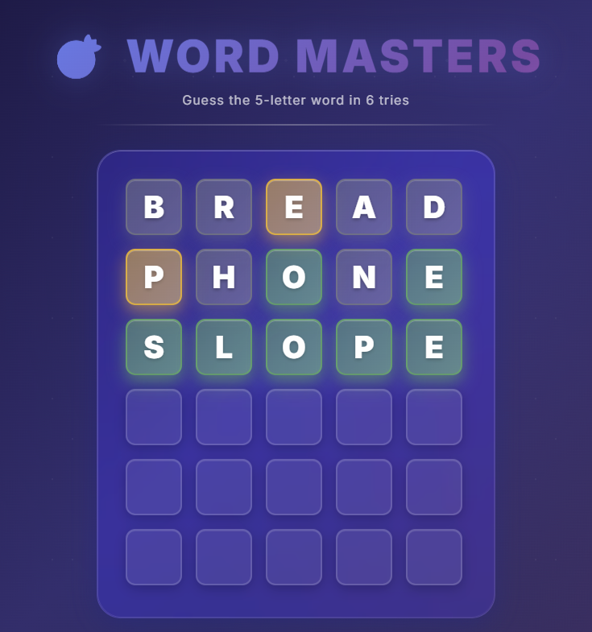

# 🎯 Word Masters

A beautiful, modern word-guessing game built with vanilla JavaScript. Challenge yourself to guess the 5-letter word in 6 tries with an elegant dark-themed UI featuring glassmorphism design.


## ✨ Features

- 🎨 **Modern UI/UX** - Sleek dark theme with glassmorphism effects
- 🌈 **Smooth Animations** - Flip animations, pop effects, and smooth transitions
- 📱 **Fully Responsive** - Works perfectly on all devices
- ⚡ **Fast & Lightweight** - Pure vanilla JavaScript, no frameworks
- 🎯 **Intuitive Gameplay** - Color-coded feedback for each guess
- 🎭 **Beautiful Modals** - Animated game-end screens with gradient borders
- ⌨️ **Keyboard Support** - Full keyboard input support
- 🔄 **Daily Words** - Fetches word of the day from API

## 🎮 How to Play

1. **Type a 5-letter word** using your keyboard
2. **Press Enter** to submit your guess
3. **Check the colors:**
   - 🟢 **Green** - Correct letter in correct position
   - 🟡 **Yellow** - Correct letter in wrong position
   - ⚫ **Gray** - Letter not in the word
   - 🩷 **Pink** - Invalid word (shake animation)
4. **Win or Lose** - You have 6 tries to guess the word!

## 🚀 Demo

Try it live: [Word Masters Game](word-masters.aylingurel.me) 

## 📸 Screenshots

### Game Interface




## 🛠️ Technologies Used

- **HTML5** - Semantic markup
- **CSS3** - Modern styling with:
  - Glassmorphism effects
  - CSS Grid & Flexbox
  - Custom animations
  - Backdrop filters
  - Gradient text
- **JavaScript (ES6+)** - Vanilla JS with:
  - Async/Await
  - Fetch API
  - DOM manipulation
  - Event handling

## 📦 Installation

1. **Clone the repository**

   ```bash
   git clone https://github.com/aylingurel1/word-masters.git
   cd word-masters
   ```

2. **Install dependencies**

   ```bash
   npm install
   ```

3. **Start development server**

   ```bash
   npm run dev
   ```

4. **Open in browser**
   ```
   http://localhost:3000
   ```

## 📁 Project Structure

```
Master-Words/
├── index.html         # Main HTML file
├── app.js             # Game logic
├── style.css          # Styles and animations
├── package.json       # Project dependencies
└── README.md          # Project documentation
```

## 🎨 Design Features

### Glassmorphism UI

- Semi-transparent backgrounds
- Backdrop blur effects
- Subtle borders and shadows
- Layered depth

### Animations

- **Pop Animation** - Letters bounce when typed
- **Flip Animation** - Tiles flip to reveal colors
- **Shake Animation** - Invalid words shake
- **Bounce Animation** - Win celebration
- **Glow Effects** - Pulsing glows on yellow/green tiles
- **Gradient Text** - Animated gradient on title


⭐ **If you like this project, please give it a star!** ⭐

Made with ❤️ and JavaScript
